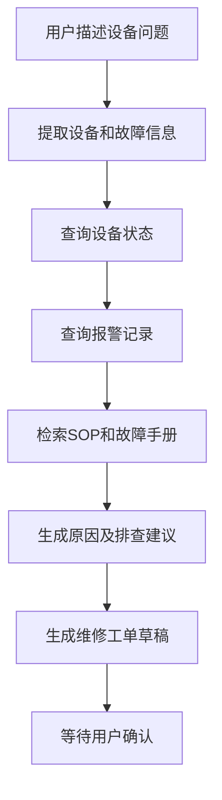

# Java 制造业 AI Agent 学习与实践手册

> 面向具有 Java 后端和制造业项目经验、AI应用基础较少，希望转向制造业 Agent 工程化落地的开发者。

## 1. 定位与目标

不要把自己定位成“零基础转AI的初级开发”，更合适的定位是：

> 具备企业级 Java 后端和制造业经验，正在升级为制造业 AI Agent 工程化落地人才。

推荐方向：

> Java/Spring企业级后端 + Agent工作流 + 制造业系统集成 + 权限、安全、审计与可观测性。

最终应具备以下能力：

- 将大模型接入MES、ERP、WMS、PLM和设备平台；
- 使用Tool Calling调用企业服务；
- 使用RAG处理SOP、设备手册和故障案例；
- 使用MCP标准化暴露和消费工具；
- 构建可控、可审计的Agent工作流；
- 建立权限、安全、评测和可观测体系。

## 2. 第一阶段的学习边界

暂时不需要学习：

- 神经网络数学推导和模型预训练；
- CUDA与分布式训练；
- 复杂模型微调；
- 一开始就私有部署大参数模型；
- 一开始就做多Agent；
- 同时主学多个Agent框架。

应优先学习：

1. 大模型API；
2. 结构化输出；
3. Tool Calling；
4. RAG知识库；
5. MCP；
6. Agent工作流；
7. 人工审批；
8. 自动评测；
9. 可观测性；
10. 安全与权限。

## 3. AI应用知识地图

### 3.1 大模型调用

可以先把大模型理解成一种特殊的外部服务：

```text
输入：自然语言 + 上下文 + 可用工具描述
输出：自然语言 / 结构化JSON / 工具调用请求
```

它与普通接口的区别是输出不完全确定，可能产生幻觉，也可能不遵守格式，因此必须增加校验、重试、评测和兜底。

### 3.2 结构化输出

传统Java系统通常要让模型返回DTO可以处理的结构：

```json
{
  "deviceCode": "SMT-003",
  "alarmCode": "E102",
  "severity": "HIGH",
  "intent": "QUERY_ALARM",
  "needHumanConfirmation": false
}
```

Java应用继续负责Schema、字段、权限和业务规则校验。

### 3.3 Tool Calling

模型不能直接查询企业数据库，也不应直接操作MES。应用将Java方法描述为工具：

```java
@Tool(description = "根据设备编号查询最近的报警记录")
public List<DeviceAlarm> getRecentAlarms(
        String deviceCode,
        Integer days) {
    return alarmService.findRecent(deviceCode, days);
}
```

模型负责选择工具和生成参数；Java系统负责权限、校验、真实调用、超时、重试、幂等和审计。

### 3.4 RAG知识库

RAG用于让模型依据企业内部资料回答问题：

```text
设备手册/SOP/故障案例
→ 文档解析与清洗
→ 文档分块
→ Embedding
→ 向量数据库
→ 检索相关片段
→ 模型依据片段回答
```

高质量RAG需要来源引用、文档版本、Metadata过滤、数据权限和检索效果评测。

### 3.5 Agent

Agent可以理解为模型根据任务状态反复决定下一步调用哪个工具，直到完成任务或需要人工介入。

制造业更适合：

> 固定业务工作流 + 局部模型判断 + 人工审批。

### 3.6 MCP

MCP用于在模型应用和外部工具之间建立标准化连接。重点理解Host、Client、Server、工具发现、参数Schema、权限传递和安全边界。

### 3.7 评测

需要评估工具选择、参数、文档检索、答案依据、越权拦截、任务完成率、延迟和Token成本。

## 4. Java经验与Agent工程的对应关系

| 传统Java能力 | Agent工程能力 |
|---|---|
| Controller接口 | 对话或任务入口 |
| Service业务编排 | Agent工作流 |
| RPC/Feign调用 | Tool Calling |
| 接口注册与发现 | MCP工具发现 |
| DTO和参数校验 | 结构化输出与Schema校验 |
| MySQL/PostgreSQL | 企业实时业务数据 |
| Elasticsearch | RAG关键词和混合检索 |
| Redis | 会话与任务状态 |
| MQ | 长任务异步执行 |
| 工作流引擎 | Human-in-the-loop |
| RBAC | 工具和数据权限 |
| 操作日志 | Agent审计日志 |
| 链路追踪 | 模型和工具调用追踪 |
| 单元测试 | Agent评测集 |
| 熔断降级 | 模型切换和规则兜底 |

## 5. 推荐技术栈

```text
Java 21
Spring Boot
Spring AI / Spring AI Alibaba
PostgreSQL + pgvector
Redis
Maven
Docker Compose
Micrometer / OpenTelemetry
```

- 主攻Spring AI或Spring AI Alibaba；
- LangChain4j用于阅读和对比示例；
- Python只用于数据清洗和快速实验；
- 核心作品服务使用Java实现。

建议时间分配：70% Java和工程化，20% LLM/RAG/Agent原理，10% Python。

## 6. 30天入门计划

### 第1周：模型API与结构化输出

学习模型消息、Token、上下文、流式输出和结构化JSON。

实践任务：

1. 创建Spring Boot项目；
2. 调用一个主流模型；
3. 实现普通问答和SSE流式输出；
4. 将设备故障描述转换成Java DTO；
5. 校验模型输出并处理错误；
6. 记录模型名称、耗时和Token。

示例输入：

```text
三号贴片机今天下午连续出现5次E102报警，生产已经暂停。
```

期望输出：

```json
{
  "deviceName": "三号贴片机",
  "alarmCode": "E102",
  "alarmCount": 5,
  "productionStopped": true,
  "urgency": "HIGH"
}
```

### 第2周：Tool Calling

使用H2或内存数据模拟以下工具：

```text
getDeviceInfo
getDeviceStatus
getRecentAlarms
getMaintenanceHistory
getProductionOrder
```

目标流程：识别设备、查询状态、查询报警、必要时查询维修记录，最后生成有依据的回答。

验收标准：工具选择和参数正确；设备不存在、超时和异常有处理；调用有审计；未授权工具不能执行。

### 第3周：RAG知识库

自行编写模拟资料：

```text
E101故障处理说明.md
E102故障处理说明.md
SMT设备日常点检SOP.md
设备维修安全规范.md
维修工单填写规范.md
```

实现文档读取、清洗、分块、Embedding、向量存储、Metadata过滤和来源引用。

推荐Metadata：

```json
{
  "documentId": "SOP-SMT-001",
  "documentName": "SMT设备点检SOP",
  "version": "V2.1",
  "deviceModel": "SMT-X200",
  "factoryId": "FACTORY-01",
  "departmentId": "EQUIPMENT",
  "securityLevel": "INTERNAL",
  "page": 12,
  "section": "4.2 日常点检"
}
```

回答必须包含资料名称、章节和版本；没有依据时明确说不确定。

### 第4周：组合为小型Agent



第一个月最终产物：制造业设备故障诊断助手V1.0。

## 7. 工程化进阶路线

### 第5周：MCP

把设备、报警、维修、生产和工单能力封装为MCP工具。

| 风险等级 | 操作 | 控制方式 |
|---|---|---|
| L1 | 查询设备、SOP、报警 | 权限通过后执行 |
| L2 | 创建工单草稿 | 告知用户并预览 |
| L3 | 提交工单或修改数据 | 二次确认与人工审批 |

### 第6周：Agent工作流

学习Router、ReAct、Planner—Executor、Human-in-the-loop、状态机、失败重试和断点恢复。优先做好可控的单Agent，不盲目追求多Agent。

### 第7周：安全与权限

- 查询与写工具分离；
- RBAC和数据权限；
- 身份从服务端上下文获取；
- 不信任模型传来的userId；
- SQL参数化；
- 提示词注入防护；
- 敏感字段脱敏；
- 写操作审批和幂等。

### 第8周：自动评测

建立至少50条测试用例：

| 指标 | 含义 |
|---|---|
| 检索命中率 | 正确资料是否进入结果 |
| 引用准确率 | 引用是否支持答案 |
| 工具选择正确率 | 是否选择正确工具 |
| 参数准确率 | 设备编号和时间是否正确 |
| 任务完成率 | 是否完成业务目标 |
| 越权拦截率 | 非授权操作是否被阻止 |
| 平均延迟 | 单次任务耗时 |
| 平均成本 | 单次任务Token或费用 |

### 第9周：可观测性

记录traceId、userId、agentTaskId、模型、Prompt版本、工具名称、参数摘要、调用状态、Token、耗时、重试和错误码。

不要记录未脱敏生产数据、客户信息、密码、内部文档全文和敏感工具参数。

### 第10周：部署与作品包装

- Docker Compose一键启动；
- 项目架构图；
- 模拟数据和初始化脚本；
- API文档；
- 评测报告；
- 安全设计说明；
- 3—5分钟演示视频；
- 面试项目介绍。

## 8. 从制造业旧项目寻找Agent场景

复盘过去项目时回答：

| 问题 | 示例 |
|---|---|
| 项目服务谁 | 设备工程师、生产主管 |
| 用户每天做什么 | 查报警、分析原因、建工单 |
| 数据在哪里 | MySQL、ES、设备平台 |
| 文档在哪里 | SOP、说明书、维修案例 |
| 哪些工作重复 | 查询多个系统并整理报告 |
| 哪些环节需要判断 | 分析原因和排查顺序 |
| 哪些操作有风险 | 停机、改参数、提交工单 |
| Agent能辅助什么 | 查询、归纳、生成草稿 |
| 哪些必须由人做 | 审批、停机和生产变更 |

最终将旧项目转换为：

```text
自然语言入口
+ 业务查询工具
+ 企业知识库
+ 固定工作流
+ 人工审批
+ 审计与评测
```

优先寻找四类机会：

1. 人经常查询的信息，转换为Tool或RAG；
2. 人经常综合判断的问题，转换为辅助分析；
3. 人经常重复填写的报告，转换为可审核草稿；
4. 依赖老师傅经验的工作，转换为知识库和案例辅助。

## 9. 推荐实践项目

### 9.1 设备运维Agent

最适合入门，涉及设备、报警、维修记录、SOP和维修工单。

示例问题：

> 3号产线贴片机频繁报警E102，请分析可能原因并给出处置建议。

系统依次查询设备、报警和维修历史，检索SOP，生成带来源的检查步骤，再创建维修工单草稿并等待确认。

### 9.2 质量异常分析Agent

涉及质检数据、产品批次、设备参数、原材料、历史异常和8D报告。制造业特色更强，但复杂度更高。

### 9.3 生产运营问数Agent

回答产量、设备利用率、工单完成率、不良率和停机时间。必须严格控制Text-to-SQL权限、只读范围和资源消耗。

## 10. 最终作品结构

```text
manufacturing-agent-platform
├── agent-api              REST/SSE接口
├── agent-core             Agent循环与工作流
├── agent-tools            Spring AI工具定义
├── mcp-device-server      设备MCP Server
├── mcp-order-server       工单MCP Server
├── knowledge-service      RAG与来源引用
├── approval-service       人工审批
├── evaluation-service     自动评测
├── observability          指标、日志与追踪
├── mock-mes               模拟MES
├── mock-device-platform   模拟设备平台
└── deploy                 Docker Compose
```

推荐数据表：

```text
device
device_alarm
maintenance_record
production_order
quality_incident
knowledge_document
knowledge_chunk
agent_task
agent_step
tool_call_log
approval_record
evaluation_case
evaluation_result
```

项目至少演示设备报警分析、SOP问答、维修工单审批三个场景。

## 11. 视频和中文文档学习方法

推荐比例：

> 20%中文视频建立认知 + 30%中文文档完成入门 + 50%项目编码和官方文档查漏补缺。

每观看30—45分钟就暂停并写代码：

| 内容 | 当天代码成果 |
|---|---|
| ChatModel | Java调用模型并流式输出 |
| 结构化输出 | 转换为设备故障DTO |
| Tool Calling | 调用设备查询工具 |
| RAG | 检索SOP并返回引用 |
| MCP | 暴露设备查询MCP工具 |
| Agent | 完成查询、分析、确认、建单 |
| Evaluation | 编写10条测试用例 |

视频搜索关键词：

```text
Spring AI Alibaba 实战
Spring AI Tool Calling
Spring AI RAG pgvector
Spring AI MCP Java
Spring AI Agent Graph
大模型应用评测
RAG 检索优化
MCP 原理 Java
```

优先选择最近一年、标明版本、提供GitHub源码并讲解异常处理和评测的课程。避免只讲Prompt、只做聊天页面或过度宣传多Agent的课程。

## 12. 学习资料

### 中文资料

- [Spring AI Alibaba Chat Model教程](https://sca.aliyun.com/en/docs/ai/tutorials/chat-model/)
- [Spring AI Alibaba RAG实践](https://sca.aliyun.com/en/docs/ai/practices/rag/)
- [Spring AI Alibaba官方示例](https://github.com/spring-ai-alibaba/examples)
- [Spring AI Alibaba项目](https://github.com/alibaba/spring-ai-alibaba)
- [Spring AI应用开发课程介绍](https://edu.aliyun.com/certification/CLDM09)
- [Spring AI Alibaba DataAgent](https://github.com/spring-ai-alibaba/DataAgent)

### Spring AI官方资料

- [Spring AI基础概念](https://docs.spring.io/spring-ai/reference/concepts.html)
- [Spring AI API](https://docs.spring.io/spring-ai/reference/api/)
- [Spring AI Tool Calling](https://docs.spring.io/spring-ai/reference/api/tools.html)
- [Spring AI ETL Pipeline](https://docs.spring.io/spring-ai/reference/api/etl-pipeline.html)
- [Spring AI MCP](https://docs.spring.io/spring-ai/reference/api/mcp/mcp-overview.html)
- [Spring Java MCP](https://docs.spring.io/spring-ai-mcp/reference/overview.html)
- [Spring AI MCP注解示例](https://docs.spring.io/spring-ai/reference/api/mcp/mcp-annotations-examples.html)
- [Spring AI Evaluation Testing](https://docs.spring.io/spring-ai/reference/api/testing.html)
- [Spring AI Observability](https://docs.spring.io/spring-ai/reference/observability/index.html)

### 补充资料

- [LangChain4j官方示例](https://github.com/langchain4j/langchain4j-examples)
- [LangChain4j RAG教程](https://github.com/langchain4j/langchain4j/blob/main/docs/docs/tutorials/rag.md)
- [LangChain4j高级RAG示例](https://github.com/langchain4j/langchain4j-examples/blob/main/rag-examples/src/main/java/_3_advanced/_04_Advanced_RAG_with_Metadata_Example.java)
- [MCP官方架构](https://modelcontextprotocol.io/specification/2025-06-18/architecture)

## 13. 安全与保密

- 不使用原公司真实生产数据；
- 不上传原公司内部文档；
- 不复刻原公司保密表结构和接口；
- 所有设备、报警、SOP和工单数据自行模拟；
- 模型输出不能直接修改生产数据；
- 写操作必须校验、鉴权并人工确认；
- 日志中的敏感信息必须脱敏。

## 14. 常见误区

- 只研究Prompt，不理解Tool Calling；
- 只做聊天机器人，不接业务工具；
- 只做向量检索，不做引用、权限和评测；
- 直接执行模型生成的SQL；
- 单Agent还不稳定就追求多Agent；
- 没有测试集，凭主观感觉判断效果；
- 没有审计日志，无法回放失败过程；
- 同时追逐多个框架；
- 为追求真实性使用公司机密资料。

## 15. 面试介绍模板

> 我实现了一个制造业设备运维Agent。系统通过RAG检索设备手册、SOP和历史故障案例，通过MCP接入设备、报警和工单系统。查询操作可以自动完成，写操作必须经过用户确认和审批。系统对每次模型与工具调用进行审计，并通过离线测试集评估检索命中率、工具选择正确率和任务成功率。核心服务使用Java、Spring Boot和Spring AI实现。

## 16. 第一周每日任务

1. 第1天：理解模型输入、输出、Token和上下文，创建Spring Boot项目；
2. 第2天：完成Java模型调用，使用Postman测试；
3. 第3天：实现流式输出，记录Token和耗时；
4. 第4天：让模型输出固定JSON并转换成Java DTO；
5. 第5天：实现字段校验和格式错误处理；
6. 第6天：准备10条设备故障测试数据并记录结果；
7. 第7天：整理README，说明功能、限制和下一步计划。

第一周最终闭环：

> 输入设备故障描述 → 模型提取结构化信息 → Java校验 → 返回规范化结果。

## 17. 学习进度清单

- [ ] Java成功调用大模型
- [ ] 实现SSE流式输出
- [ ] 实现结构化输出和DTO校验
- [ ] 实现第一个Tool Calling工具
- [ ] 实现五个制造业查询工具
- [ ] 导入第一批SOP知识文档
- [ ] 回答能够返回来源引用
- [ ] 实现Metadata权限过滤
- [ ] 完成第一个MCP Server
- [ ] 实现人工确认和审批
- [ ] 建立至少50条评测数据
- [ ] 接入Tracing和指标
- [ ] Docker Compose一键部署
- [ ] 完成架构图和README
- [ ] 录制项目演示视频
- [ ] 准备项目面试介绍
