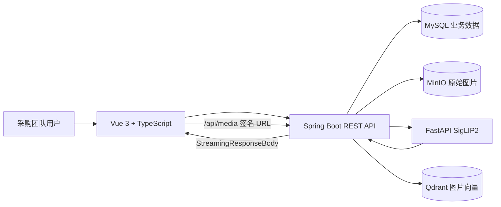

# 义采通采购管理系统：核心亮点与简历项目经历

> 本文基于当前实际代码整理，不虚构并发量、准确率或性能提升数字。获得真实压测和检索评估结果后，可再补充量化指标。

## 1. 项目定位

义采通是一套面向采购团队的多租户采购协同系统，覆盖“供应商/商品建档—结构化选品—创建采购任务—买手执行—历史采购复用”的业务闭环，并引入 SigLIP2 与 Qdrant 实现饰品图片相似检索。

主要模块：

- 用户注册、登录、主账号与子账号管理；
- 选品中心：商品、店铺、档口位置搜索及历史热采排序；
- 今日采购：急采、跨天任务、运营/买手协作、实采回填；
- 档案管理：店铺、门头图、商品多图、上下架和软删除；
- 以图搜图：人工框选目标商品，SigLIP2 建模，Qdrant Top 20 检索；
- 多租户、RBAC、私有图片代理、Flyway、链路日志和部署脚本。

## 2. 简历可直接使用

### 2.1 Java 后端岗位版本（推荐）

**义采通采购管理系统｜Java 后端 / 全栈开发**

**技术栈：** Java 21、Spring Boot 3.5、Spring Data JPA、MySQL 8.4、Flyway、MinIO、Qdrant、SigLIP2、Python FastAPI、Vue 3、TypeScript、Vite、Docker Compose、Logback

**项目描述：** 面向采购团队的多租户采购协同系统，覆盖供应商与商品建档、选品、采购任务协作、历史采购统计和以图搜图，支持管理员、运营、买手、查看者等角色。

**核心工作：**

- 设计基于数据库会话、`ThreadLocal` 请求上下文和 `tenantId` 的多租户隔离方案，由后端从 Bearer Token 恢复可信租户身份，核心查询同时校验资源 ID 与租户归属，防止横向越权。
- 建立 ADMIN、OPERATOR、BUYER、VIEWER 四类 RBAC 权限，在接口层校验操作权限，并按角色隐藏店铺名称、档口位置等敏感字段。
- 设计采购任务生命周期，支持急采、跨天未完成任务、运营/买手双备注、实采数量和价格回填；订单保存商品与店铺快照，保证档案变更或软删除后历史记录仍可读。
- 将图片检索拆分为 Spring Boot 业务服务、FastAPI SigLIP2 推理服务和 Qdrant 向量库；支持单张原图人工框选最多 20 个商品区域，后端按原图坐标裁剪并逐框建模。
- 在 Qdrant 检索中强制按租户过滤、按商品聚合最高相似度，并回查 MySQL 过滤下架/软删除商品，返回相似度 Top 20。
- 使用 MinIO 保存原始商品图与店铺门头图，裁剪图仅在内存向量化；实现 HMAC-SHA256 短期签名媒体地址和 Spring Boot 流式代理，解决 HTTPS 外网访问内网 HTTP MinIO 的问题。
- 使用 Flyway 管理表、字段注释、索引、外键、检查约束和存储过程；完成 19 个 UUID 字段从 `BINARY(16)` 到可读 `CHAR(36)` 的无损迁移并恢复 13 个外键。
- 建立 MDC `requestId` 链路日志，记录状态码、耗时和客户端地址；Logback 支持按日期/大小滚动、压缩归档、保留周期和容量上限。
- 固定 SigLIP2 权重 revision、Transformers、PyTorch、Qdrant 和 MinIO 版本，Java 侧校验模型版本并按版本隔离 Collection，避免不兼容向量混用。

### 2.2 一页简历压缩版

**义采通采购管理系统｜Java / Vue 全栈开发**  
Java 21、Spring Boot 3、MySQL、Flyway、MinIO、Qdrant、SigLIP2、FastAPI、Vue 3、TypeScript

- 完成选品、今日采购、供应商/商品档案和团队账号管理，建立四角色 RBAC 与服务端多租户数据隔离。
- 设计急采、跨天任务、运营/买手备注、实采回填和历史采购统计，使用业务快照与软删除保证历史稳定。
- 实现人工多框选以图搜图：后端裁剪、SigLIP2 向量化、Qdrant 租户过滤、按商品聚合及 Top 20 检索，裁剪图不落盘。
- 基于 MinIO 和 HMAC 短期签名实现私有图片流代理，解决 HTTPS 混合内容和对象存储地址暴露问题。
- 使用 Flyway 管理数据库版本，搭建 Request ID 链路日志、依赖版本锁定及 Windows/Docker Compose 部署方案。

### 2.3 AI 应用工程版本

- 将 `google/siglip2-base-patch16-224` 封装为 FastAPI 推理服务，输出归一化图片向量，Spring Boot 负责编排、权限与模型版本校验。
- 针对“一张供应商图包含多个饰品”的场景，用人工多框选代替早期 YOLO 训练：后端按原图像素裁剪，每个区域生成独立向量并关联同一商品。
- 使用 Qdrant Cosine 相似度，强制 `tenantId` Filter、按 `productId` 聚合最佳分数，并通过可配置阈值返回 Top 20。
- 将 Qdrant 定位为可重建召回索引，商品价格、上下架、删除状态和店铺信息实时回查 MySQL，避免双写不一致。

## 3. 系统架构



| 组件 | 保存内容 | 职责 |
|---|---|---|
| MySQL | 租户、用户、店铺、商品、图片元数据、订单、会话 | 强一致业务关系、事务与结构化检索 |
| MinIO | 商品原图、店铺门头图 | S3 兼容大对象存储 |
| Qdrant | 图片向量、`tenantId`、`productId` | 近似向量召回 |
| FastAPI/SigLIP2 | 图片预处理和推理 | 解耦 Python AI 生态与 Java 业务系统 |

关键原则：MySQL 是业务事实库，MinIO 是图片正文库，Qdrant 是可重建的派生索引。

## 4. 核心技术亮点详解

### 4.1 多租户隔离与 RBAC

登录成功后，后端生成数据库会话 Token，记录 `userId`、`tenantId`、角色和有效期。`AuthFilter` 从 Bearer Token 恢复身份并写入 `ThreadLocal<CurrentUser>`，请求结束在 `finally` 中清理，避免线程池复用导致上下文串用。

所有关键业务查询都使用服务端会话中的 `tenantId`，不信任客户端自行传入的租户参数。`UserContext.require(...)` 在后端校验角色，前端隐藏按钮仅用于体验优化。

| 角色 | 主要能力 |
|---|---|
| ADMIN | 档案、采购、团队账号和采购主体管理 |
| OPERATOR | 搜索选品、创建采购任务、维护计划数量和运营备注 |
| BUYER | 查看供应商/档口、填写实采数据和买手备注、完成采购 |
| VIEWER | 只读查看允许展示的数据 |

除接口授权外，系统还执行响应字段级控制：运营可见店铺名称，但档口位置只向管理员和买手开放。

**面试表达：**

> 我没有信任前端 tenantId。后端通过数据库会话恢复租户上下文，业务查询同时限定资源 ID 和 tenantId，Qdrant 检索也强制 tenantId Filter，因此篡改 URL 中的 ID 不能访问其他租户数据。

### 4.2 采购业务闭环与历史稳定性

- 管理员/运营创建任务，填写计划数量、急采和运营备注；
- 管理员/买手回填实采数量、实际单价和买手备注；
- 今日列表合并当天创建/完成订单与历史遗留未完成订单；
- 完成采购时在事务中更新订单和商品累计实采件数；
- 选品中心按累计实际采购件数倒序展示热采商品；
- 已完成订单按完成时间展示，跨天和急采在前端高亮。

订单保存 `productNameSnapshot`、`storeNameSnapshot`、`storeLocationSnapshot`。商品改名、店铺迁址或档案软删除后，历史采购记录仍显示创建时的信息。店铺和商品采用软删除，删除后退出选品与搜图结果，但不破坏历史订单。

### 4.3 人工多框选 + SigLIP2

#### 问题

发饰、耳环供应商照片经常一图多品。直接整图建模会被背景和其他商品干扰；早期引入 YOLO 则需要标注集、训练和类别维护。

#### 链路

1. 用户上传原图并在前端框选一个或多个目标区域；
2. 前端将显示坐标换算成原图像素坐标；
3. 后端校验不越界、区域至少 8×8，每次最多 20 个框；
4. 使用 `BufferedImage.getSubimage` 在后端逐框裁剪；
5. 裁剪区域只在内存转为 JPEG，并调用 SigLIP2；
6. 每个区域生成独立 Qdrant Point，关联同一 `productId`；
7. 原图只在 MinIO/MySQL 保存一次，裁剪小图不落盘。

一个商品可以有多个角度和局部向量。检索后按 `productId` 取最高相似度，避免同一商品的多个向量重复占满 Top 20。

#### 取舍

人工框选不依赖检测训练集，目标可解释、可修正，适合项目早期。未来可把积累的框选数据用于训练检测模型，升级为“自动框选 + 人工确认”。

### 4.4 Qdrant 检索与 MySQL 二次过滤

```text
查询区域 → SigLIP2 归一化向量 → Qdrant Cosine 检索
→ tenantId 过滤 → 相似度阈值 → 按 productId 取最高分
→ Top 20 → MySQL 回查 → 过滤下架/软删除并补齐业务信息
```

Qdrant Payload 只保存：

- `tenantId`：检索时隔离租户；
- `productId`：关联 MySQL。

价格、店铺、位置、上下架和删除状态会频繁变化，若复制到 Qdrant 会带来双写一致性问题。当前设计让 MySQL 始终作为权威数据源，Qdrant 可随时重建。

当前使用 Cosine 距离，初步召回 100 个向量点，按 `IMAGE_SEARCH_THRESHOLD` 过滤，最终返回最多 20 个商品。

### 4.5 模型与向量兼容性

向量模型升级不是普通依赖升级：即使维度相同，不同权重的向量空间也可能不兼容。项目采用四层约束：

1. 固定模型 `google/siglip2-base-patch16-224`；
2. 固定权重 revision `75de2d55ec2d0b4efc50b3e9ad70dba96a7b2fa2`；
3. Python 返回完整 `modelVersion`，Java 写入前强校验；
4. Qdrant Collection 名称携带版本标识。

模型升级必须新建 Collection 并重新向量化，不能将新向量混写入旧集合。

### 4.6 MinIO 私有图片与 HTTPS 同源代理

#### 背景

本地 MinIO 是 HTTP，系统通过 HTTPS 内网穿透访问。浏览器会拦截 HTTPS 页面加载 HTTP 图片；直接公开 MinIO 还会暴露存储地址和对象路径。

#### 最终方案

```text
外部浏览器 → HTTPS 当前域名 /api/media/...
→ Spring Boot 校验业务资源、租户、有效期和 HMAC 签名
→ 读取私有 MinIO → StreamingResponseBody 返回图片
```

签名包含资源类型、资源 ID、租户 ID 和过期时间，使用 HMAC-SHA256，默认一小时有效。

收益：

- 不产生 Mixed Content；
- 不把登录 Token 写入图片 URL；
- 不暴露 MinIO Endpoint、Bucket、对象键或密钥；
- 商品/店铺软删除后，即使签名未到期也会因业务校验失效；
- 流式响应避免一次性把整图放入响应字节数组。

### 4.7 Flyway 与可读 UUID 迁移

Flyway V1—V5 管理表结构、字段注释、查询索引、外键、检查约束、存储过程、手机号、急采字段和 UUID 迁移。Hibernate 使用 `ddl-auto=validate`，只校验而不自动修改结构。

UUID 迁移的实际步骤：

1. `mysqldump --hex-blob` 创建可恢复备份；
2. 在临时数据库完整演练；
3. 暂时解除 13 个外键；
4. 将 19 个 `BINARY(16)` 字段扩展并按原字节顺序转为标准 UUID；
5. 固定为 `CHAR(36) CHARACTER SET ascii COLLATE ascii_bin`；
6. 恢复外键并回归登录、商品、采购和图片接口。

Java 仍使用强类型 `UUID`，通过 `@JdbcTypeCode(SqlTypes.CHAR)` 显式映射，兼顾代码类型安全和 DBeaver 人工可读性。

### 4.8 链路日志与故障排查

`RequestLoggingFilter` 生成或透传 `X-Request-Id` 并写入 MDC，记录请求方法、URI、状态码、耗时和客户端地址。Logback 同时输出控制台与文件，支持：

- 按日期和 100 MB 大小切分；
- Gzip 压缩；
- 默认保留 30 天；
- 总容量上限 10 GB；
- 应用、Web、SQL、参数绑定日志分级配置。

这样可以按 Request ID 串联接口日志和异常堆栈，并避免日志无限增长占满磁盘。

### 4.9 前端工程与交互

前端使用 Vue 3 Composition API、TypeScript、Vite，并按模块组织：

```text
frontend/src/pages/
├─ auth/        登录与注册
├─ selection/   选品中心
├─ purchases/   今日采购
├─ archives/    档案管理
└─ profile/     我的与团队账号
```

关键交互包括独立业务地址、图片轮播与大图、搜图预览、Canvas 多框选、框选队列、采购数据每 2 秒刷新、日期筛选、跨天/急采高亮、按角色展示操作，以及 API 统一错误解析和 Toast。

### 4.10 Windows 与 Docker 双运行方案

开发机 Docker Desktop 环境受限，因此提供 PowerShell 脚本，从 `D:\InventoryRuntime` 按端口检查并启动 MySQL、MinIO、Qdrant、SigLIP2、Spring Boot 和 Vite，统一重定向输出日志。

项目同时保留 Docker Compose 编排，声明健康检查、服务依赖、端口、数据卷和模型缓存卷，方便迁移 Linux。面试时应说明：Windows 原生运行是当前本地交付方案，Linux 正式部署计划使用容器、TLS 入口、备份和监控。

### 4.11 工程规范

- Java：Maven Spotless + Google Java Format；
- Vue/TS/CSS/JSON：Prettier；
- 前端：`vue-tsc` 类型检查 + Vite 生产构建；
- 后端：Controller、Repository、Service、Security、Logging 分层；
- 异常：统一 `ApiException` 与全局 JSON 错误响应；
- 依赖：固定中间件和 AI 模型版本，不使用 `latest`。

## 5. 关键设计取舍

### 为什么不用 YOLO？

项目早期缺少饰品检测标注数据，而用户明确知道目标位置。人工框选成本低、结果可控；后续可将框选数据沉淀为训练集。

### 为什么裁剪图不存 MinIO？

裁剪图只是向量化中间产物，持久化会增加大量小对象、清理逻辑和隐私风险。保留原图即可满足当前业务。

### 为什么不把全部商品字段放进 Qdrant？

Qdrant 负责召回，MySQL 负责业务事实。动态字段复制会产生双写一致性问题，因此只保存租户和商品 ID。

### 为什么使用数据库会话而不是 JWT？

当前 MVP 需要立即支持账号停用、会话到期和服务端统一失效，数据库会话简单直接。规模扩大后可演进为短期 JWT + Refresh Token + Redis。

### 为什么 UUID 使用 CHAR(36)？

`BINARY(16)` 更节省索引空间，但不利于 DBeaver 人工排查。当前规模更重视可维护性，因此使用 ASCII `CHAR(36)`，Java 层仍保持 UUID 类型。

## 6. 面试常见追问

### 如何防止跨租户访问？

服务端 Token 恢复 `tenantId`；Repository 同时按 ID/tenantId 查询；Qdrant 强制 tenant Filter；请求结束清理 ThreadLocal。

### 图片检索为什么返回商品？

每个向量 Payload 携带 `productId`。检索结果按商品聚合后回查 MySQL，因此返回的是实时商品档案。

### 商品删除后旧向量怎么办？

MySQL 二次过滤保证软删除/下架商品不展示。后续可增加异步 Qdrant 清理任务，降低无效召回成本。

### MinIO 换服务器要更新 MySQL 路径吗？

MySQL 保存 Bucket 内相对对象键，不保存服务器 IP。保持 Bucket/对象键不变，只需调整 `MINIO_ENDPOINT` 和凭据。

### 为什么订单需要快照？

商品和店铺是可变档案，采购记录是历史事实；快照避免改名、迁址或删除影响历史展示。

### 项目最大的技术难点？

将多租户权限、采购业务、对象存储、AI 推理和向量检索组织成一致的数据链路，同时处理模型版本、数据权威来源、HTTPS 图片访问和历史稳定性。

## 7. STAR 案例

### 7.1 HTTPS 无法展示 MinIO 图片

**S：** MinIO 为本地 HTTP，系统经 HTTPS 穿透访问，浏览器拦截图片。  
**T：** 不直接公开 MinIO、不暴露密钥，实现安全外网图片访问。  
**A：** 改用 HMAC 短期业务资源地址，Spring Boot 校验资源和签名后流式读取私有 MinIO。  
**R：** 图片统一同源 HTTPS；对象键和存储地址不暴露；篡改签名返回 403。

### 7.2 UUID 无损迁移

**S：** `BINARY(16)` 在 DBeaver 中不可读，排查关联困难。  
**T：** 改成可读 UUID，同时保留数据与外键。  
**A：** 使用 hex-blob 备份、临时库演练、分阶段转换 19 个字段、恢复 13 个外键并接口回归。  
**R：** 全部 ID 变为标准 `CHAR(36)`，原 ID 和关联不变，业务正常。

### 7.3 一图多商品的建模问题

**S：** 供应商照片经常一图多品，整图向量易受干扰。  
**T：** 在缺少检测训练数据时提高目标可控性。  
**A：** 设计一图多框，后端原图裁剪、逐框 SigLIP2 建模，Qdrant 按商品聚合最高分。  
**R：** 一个商品可关联多个局部特征，不依赖 YOLO，且裁剪中间图不落盘。

## 8. 当前边界与改进方向

### 当前真实边界

- 当前是可运行 MVP，尚未建立完整自动化测试体系；
- 演示环境按原始需求明文保存密码，生产必须改造；
- 向量建模失败会记录状态和日志，尚未引入消息队列重试；
- Qdrant 旧向量依赖 MySQL 过滤，尚未事件驱动清理；
- 相似度阈值尚未基于真实标注集系统评估；
- Windows 脚本满足本地测试，生产仍需 Linux、TLS、备份和监控。

### 优先改进路线

1. **安全：** BCrypt/Argon2id、密钥托管、限流、安全响应头；
2. **可靠性：** 建模异步化、失败重试、幂等和补偿任务；
3. **测试：** 单元测试、Controller 集成测试、Testcontainers、E2E；
4. **性能：** 搜索下推 MySQL 并分页、解决 DTO 组装 N+1、批量查询；
5. **AI 评估：** 建立饰品验证集，评估 Recall@20、Precision@20 和阈值；
6. **运维：** Linux 容器化、Nginx、Prometheus/Grafana、定期备份；
7. **模型演进：** 使用人工框选数据训练检测模型，升级自动框选 + 人工校正。

## 9. 面试前复习清单

- 登录会话如何恢复 `tenantId`，为什么不信任客户端参数？
- 四种角色的权限和字段可见性有什么区别？
- 今日采购为什么合并跨天未完成订单？
- 采购单为什么保存业务快照？
- Canvas 坐标如何换算为原图像素坐标？
- 为什么后端裁剪，裁剪图为什么不落 MinIO？
- SigLIP2 向量怎样进入 Qdrant，怎样按商品去重？
- 为什么 Payload 只保存 `tenantId` 和 `productId`？
- 下架/软删除商品为什么不会出现在搜图结果？
- 模型 revision 与 Collection 为什么必须同时锁定？
- HMAC 媒体签名包含哪些字段，为什么不用登录 Token 放 URL？
- Flyway V5 如何保证 UUID 和外键不丢失？
- Request ID 如何贯穿日志，怎样限制日志磁盘占用？
- 当前不足是什么，准备按什么顺序生产化？

## 10. 技术栈速查

| 层次 | 技术 |
|---|---|
| 前端 | Vue 3.5、TypeScript 5.9、Vite 7、Composition API、Canvas、Prettier |
| Java 后端 | Java 21、Spring Boot 3.5.3、Spring MVC、JPA、Validation、Lombok |
| 数据库 | MySQL 8.4、Flyway、索引、外键、检查约束、存储过程 |
| 对象存储 | MinIO、MinIO Java SDK 8.5.17、S3 协议 |
| AI 服务 | FastAPI 0.115、Transformers 4.53、PyTorch 2.7、Pillow 11.2 |
| 视觉模型 | `google/siglip2-base-patch16-224`，固定 revision |
| 向量库 | Qdrant 1.18.2、Cosine、Payload Filter |
| 可观测性 | Logback、SLF4J MDC、Request ID、滚动压缩日志 |
| 工程部署 | Maven、Spotless、Docker Compose、PowerShell 启停脚本 |

---

简历正文优先使用 2.1 或 2.2；面试前重点复习第 4—9 节。项目最有辨识度的不是基础 CRUD，而是“多租户采购业务 + 人工多框选 SigLIP2 + Qdrant + MinIO 私有媒体代理 + 可演进的数据迁移与运维方案”这一整套端到端设计。
